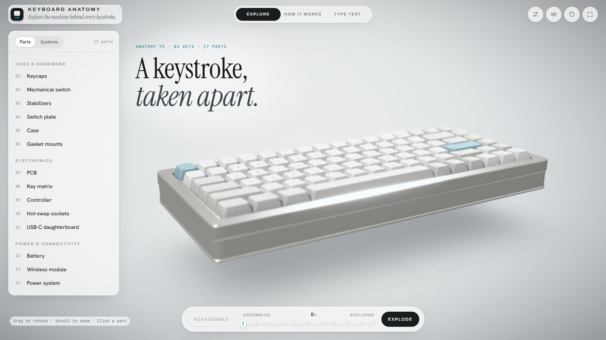
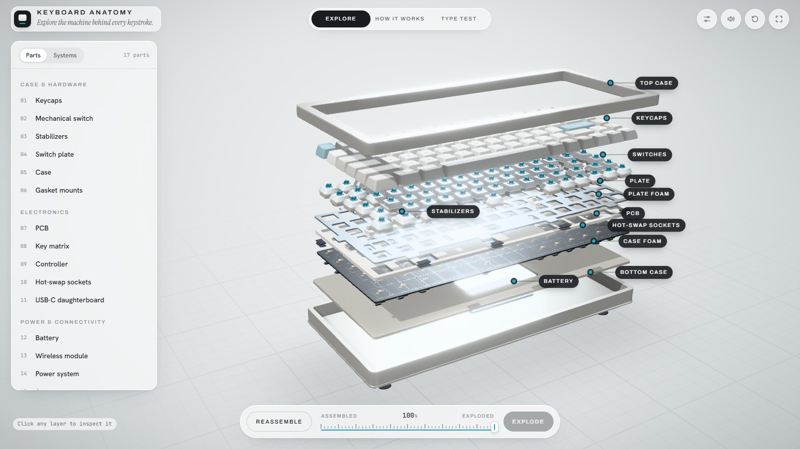
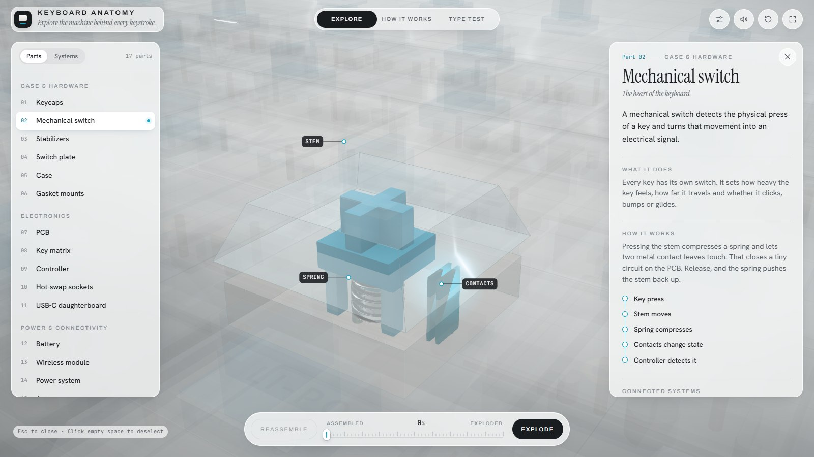
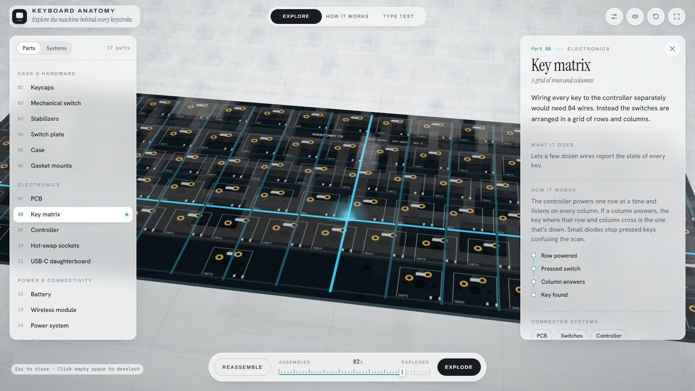

# Keyboard Anatomy

**An interactive 3D look inside a mechanical keyboard.** Pull it apart layer by layer, click on any part to see what it does, and follow a single keystroke all the way from your finger to the screen.



## What is this?

Most of us type on keyboards all day without ever thinking about what's going on underneath the keycaps. I wanted to make something that shows it, not in a diagram, but as an object you can actually turn around, take apart and poke at.

The keyboard here is a made-up but realistic 75% board I'm calling the **Anatomy 75**. It has everything a modern enthusiast keyboard has: keycaps, switches, stabilizers, a metal plate, foam, a PCB, hot-swap sockets, a controller, a battery, a wireless radio and a two-piece aluminum case. Every one of those parts is its own separate piece you can select.

| Take it apart | Look inside a switch | See how keys are detected |
| --- | --- | --- |
|  |  |  |

## Try it yourself

You'll need [Node.js](https://nodejs.org) 18 or newer.

```bash
git clone https://github.com/saniasodhi/keyboard-anatomy.git
cd keyboard-anatomy
npm install
npm run dev
```

Then open the link it prints (usually http://localhost:5173) and press **Enter experience**.

To make a production build, run `npm run build`. The finished site ends up in the `dist/` folder and can be hosted anywhere that serves static files.

## Things you can do

There are three modes, which you can switch between at the top of the page.

**Explore**
- Drag to spin the keyboard, scroll to zoom.
- Use the **Explode** slider at the bottom to pull it apart. Each part slides out along its own straight line, so you can always see where it came from.
- Click any part, either on the model or in the list on the left. The camera flies to it, everything else fades out, and a short animation shows what that part does. For example, the switch opens up to show the spring compressing, and the wireless module sends out radio waves.
- The **Systems** tab groups parts by job (power, input, acoustics and so on) and highlights them together.

**How it works**
- A seven-step walkthrough of one keystroke: power, press, actuate, detect, process, transmit, display.
- Use the arrow keys or the Next button, or press Autoplay and just watch.

**Type test**
- The keyboard settles onto a desk and types a line by itself. Then it's your turn: whatever you type on your real keyboard shows up on the 3D one, keys and sound included.

There's also a small **Customize** panel (the sliders icon, top right) where you can swap the keycap colours, switch type, plate material, backlight and connection type. The switch type changes the sound too.

## How it's made

- **React** + **Vite** for the app
- **Three.js** through **React Three Fiber** and **drei** for the 3D
- **@react-three/postprocessing** for ambient occlusion, outlines, bloom, depth of field and the vignette
- **zustand** for shared state, **GSAP** for the explode animation

There are no 3D model files or audio files in this project. The whole keyboard is built in code from simple shapes. For example, each keycap is shaped from a series of rounded outlines stacked on top of each other, with a scooped top. The PCB markings are drawn onto a canvas, and the key sounds are generated live in the browser. That keeps the download small and means every part can be moved on its own.

## Finding your way around the code

```
src/
  data/        the key layout, how far each part moves when exploded, and all the written text
  store/       app state: which mode you're in, what's selected, camera moves
  components/
    KeyboardModel/   the 3D keyboard, one file per layer
    KeyboardViewer/  the canvas, camera, lighting effects
    ...              the side panels, slider, How it works and Type test screens
  scenes/      the studio background and the desk used in Type test
  utils/       keycap shapes, materials, the sound generator
```

Some easy places to start if you want to change things:

- **Wording for each part:** `src/data/keyboardComponents.js`
- **The How it works steps:** `src/data/signalSteps.js`
- **How far things fly apart:** `src/data/explosion.js`
- **Colours and fonts:** `src/styles/tokens.css`
- **Keycap colour themes and switch colours:** `src/utils/materials.js`

### Using a real 3D model instead

Every object in the procedural model is named the way a real model file would be (`TopCase`, `Keycaps_All`, `PCB`, `Battery` and so on). If you have a GLB of an actual keyboard with the same names, `src/utils/modelUtils.js` shows how to pick those pieces out, and the exploding, highlighting and camera moves will work on it the same way.

## A few notes

- **The Anatomy 75 isn't a real product.** It's a typical example of how many keyboards are built today. Real keyboards vary a lot, and I've kept away from made-up numbers like switch force, battery capacity or polling rate.
- **It needs a browser with WebGL**, which is basically any recent Chrome, Edge, Firefox or Safari. If 3D can't start, you'll see a message with a retry button instead of a blank page.
- **It works on phones too.** The side panels turn into sheets that slide up from the bottom.
- **Reduced motion is respected.** If your system is set to reduce motion, the camera moves and animations are toned right down.
- **Slower computers** automatically get a lighter version with fewer effects.
- **Dark mode extensions** (like Dark Reader) are asked to leave the page alone, because the design only works in light mode.

## Credits

Fonts: [Instrument Serif](https://fonts.google.com/specimen/Instrument+Serif), [Archivo](https://fonts.google.com/specimen/Archivo), [Hanken Grotesk](https://fonts.google.com/specimen/Hanken+Grotesk) and [JetBrains Mono](https://fonts.google.com/specimen/JetBrains+Mono) from Google Fonts, plus [Inter](https://fontsource.org/fonts/inter) for the keycap legends.

Built on the shoulders of [three.js](https://threejs.org), [React Three Fiber](https://github.com/pmndrs/react-three-fiber), [drei](https://github.com/pmndrs/drei) and [postprocessing](https://github.com/pmndrs/postprocessing).
